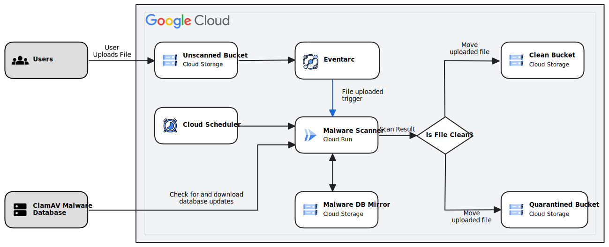

## Malicious Docker Payloads

This docker image is intended to emulate malicious behavior to test [EDR/Anti](https://www.wicar.org/test-malware.html) Virus solutions on Docker/Kubernetes [Hosts/Clusters](https://www.wicar.org/test-malware.html).

## How To Run
```
git clone https://github.com/pxcs/Payloads_Docker && cd Payloads_Docker
docker build -t Payloads_Docker:latest .
docker run Payloads_Docker:latest
```

## What Tests are Running?

### Anti Virus
[EICAR Malware Sample](https://www.wicar.org/test-malware.html)

### Network Endpoint Protection
[Flightsim Malicious Network Sample](https://github.com/alphasoc/flightsim)
<hr>

- Defensive explaination
## How Malware Scanner Service works

This repository contains the code to build a pipeline that scans objects
uploaded to GCS for malware, moving the documents to a clean or quarantined
bucket depending on the malware scan status.

It illustrates how to use Cloud Run and Eventarc to build such a pipeline.



## Example

Use the
[tutorial](https://cloud.google.com/solutions/automating-malware-scanning-for-documents-uploaded-to-cloud-storage)
to understand how to configure your Google Cloud Platform project to use Cloud
Run and Eventarc.

## Using Environment variables in the configuration

The tutorial above uses a configuration file `config.json` built into the Docker
container for the configuration of the unscanned, clean, quarantined and CVD
updater cloud storage buckets.

Environment variables can be used to vary the deployment in 2 ways:

### Expansion of environment variables

Any environment variables specified using shell-format within the `config.json`
file will be expanded using
[`envsubst`](https://manpages.debian.org/bookworm/gettext-base/envsubst.1.en.html).

### Passing entire configuration as environment variable

An alternative to building the configuration file into the container is to use
environmental variables to contain the configuration of the service, so that
multiple deployments can use the same container, and configuration updates do
not need a container rebuild.

This can be done by setting the environmental variable `CONFIG_JSON` containing
the JSON configuration, which will override any config in the `config.json`
file.

If using the `gcloud run deploy` command line, this environment variable must be
set using the
[`--env-vars-file`](https://cloud.google.com/sdk/gcloud/reference/run/deploy#--env-vars-file)
argument, specifying a YAML file containing the environment variable definitions
(This is because the commas in JSON would break the parsing of `--set-env-vars`)

Take care when embedding JSON in YAML - it is recommended to use the
[Literal Block Scalar style](https://yaml-multiline.info/) using `|`, as this
preserves newlines and quotes

#### Big Thanks to googlecloud for explaination
